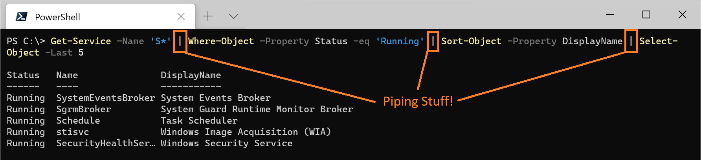
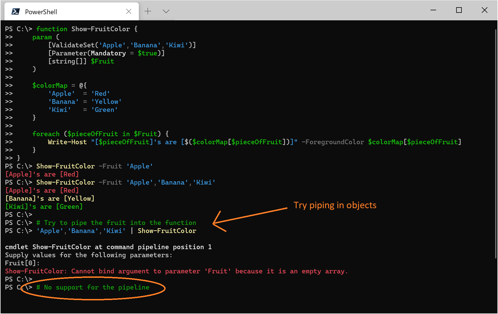
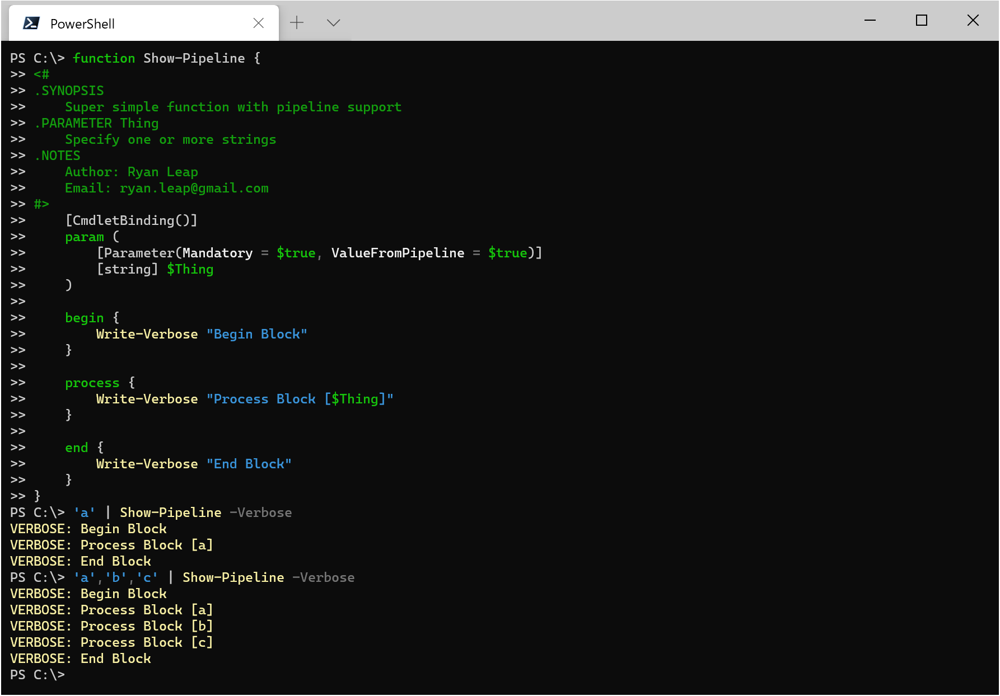
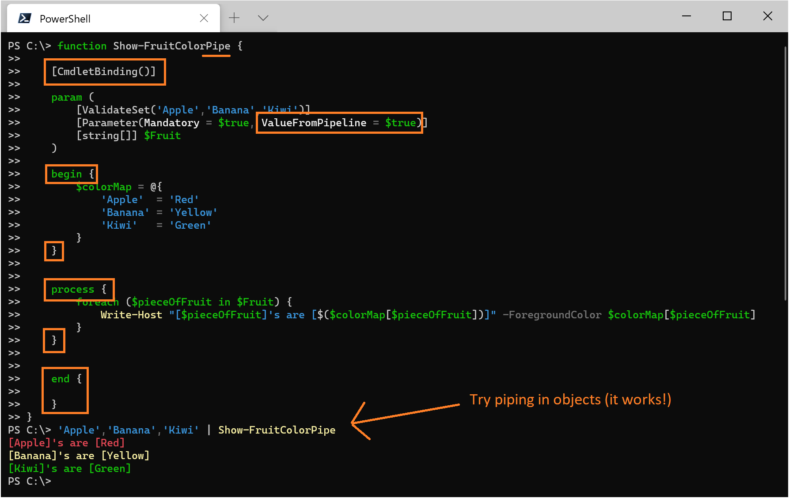

# A Piping Hot Demo - Add pipeline support to a PowerShell Function!

## The Pipeline

With PowerShell you can ['pipe'](https://docs.microsoft.com/en-us/powershell/module/microsoft.powershell.core/about/about_pipelines?view=powershell-7) objects from one cmdlet to another.  Once you get the hang of the filtering and sorting cmdlets you can leverage the pipeline to quickly refine results down to just that which you are after:



This is a great feature of the shell and as it turns out (with just a little bit of code) you can add pipeline support to the functions you write.  Interested?  Follow along!

## Pipe objects to my function?  Nope.

Below is a simple function which accepts one or more pieces of fruit as an argument. As you can see though, that same
fruit can't be passed in from the pipeline:



Notice that we can't pipe data into our function because our ```Fruit``` parameter doesn't support it. Well that's no good - let's fix it!

## So what's the trick (to get pipeline support)?

Okay, so what's it take to get that pipeline piping? Not much - check out this *super simple* function which has pipeline support:



Notice the ```begin``` block gets entered once at the *beginning*, the ```process``` block gets entered *for each object* in the pipeline, and the ```end``` block get entered once at well, the *end*.

## Let's do this (add pipeline support)!

Okay, so let's steal from the simple example above the things we need to add pipeline support to our original function:

1. Add the [CmdletBinding](https://docs.microsoft.com/en-us/powershell/module/microsoft.powershell.core/about/about_functions_cmdletbindingattribute?view=powershell-7) attribute to the function
1. Add the [ValueFromPipeline](https://docs.microsoft.com/en-us/powershell/module/microsoft.powershell.core/about/about_functions_advanced_parameters?view=powershell-7#valuefrompipeline-argument) attribute to the parameter
1. Add a [begin](https://docs.microsoft.com/en-us/powershell/module/microsoft.powershell.core/about/about_functions_advanced_methods?view=powershell-7#begin) block (initialization code goes here)
1. Add a [process](https://docs.microsoft.com/en-us/powershell/module/microsoft.powershell.core/about/about_functions_advanced_methods?view=powershell-7#process) block (code that needs to run against each piped object goes here)
1. Add a [end](https://docs.microsoft.com/en-us/powershell/module/microsoft.powershell.core/about/about_functions_advanced_methods?view=powershell-7#end) block (cleanup code goes here)



That did it - piping hot fruit coming right up!

## Conclusion

One of the things that makes PowerShell so slick is its support for the pipeline.  You can extend that pipeline coolness into your own functions by adding in just a few lines of code - so why not do it?  Enjoy!